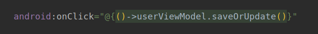

# Android & Kotlin：基于Room、Kotlin协程的MVVM app

本篇主要介绍Android系统通过Room进行CRUD操作，以及使用kotlin协程的处理方法。

## 0. 效果展示


## 1. 添加依赖

注释使用`kapt`

```java
apply plugin: 'kotlin-kapt'
```

### 1.1  lifecycle

通过这个可以获取其他组建生命周期变化

+ 这里注释使用kapt，选着相应的注释依赖

```java
def lifecycle_version = "2.2.0"
// ViewModel
implementation "androidx.lifecycle:lifecycle-viewmodel-ktx:$lifecycle_version"
// LiveData
implementation "androidx.lifecycle:lifecycle-livedata-ktx:$lifecycle_version"
// 基于kotlin-kapt的注释组建
kapt "androidx.lifecycle:lifecycle-compiler:$lifecycle_version"
```

### 1.2 Room

+ Room就好像spring中的jpa，让CRUD更简单

```java
def room_version = "2.2.5"
implementation "androidx.room:room-runtime:$room_version"
 // Kotlin 使用 kapt
kapt "androidx.room:room-compiler:$room_version" 

// optional - Kotlin Extensions and Coroutines support for Room 协程操作库
implementation "androidx.room:room-ktx:$room_version"
```

### 1.3 kotlin协程

+ 添加coroutines依赖 以及 android协程依赖

```java
// 添加协程安卓库
implementation 'org.jetbrains.kotlinx:kotlinx-coroutines-core:1.3.9'
implementation 'org.jetbrains.kotlinx:kotlinx-coroutines-android:1.3.9'
```

### 1.4 数据库表导出

+ 配置在`defaultConfig`中，将`room.schemaLocation`导出

```java
javaCompileOptions {
    annotationProcessorOptions {
        arguments = ["room.schemaLocation": "$projectDir/schemas".toString()]
    }
}
```

### 1.5 dataBinding

+ 需要在配置`android`中激活dataBinding

```java
dataBinding{
    enabled = true
}
```


## 2. 数据表实现

跟spring的配置差不多，model，dao，sersice这些

### 2.1 创建一个User类

+ User类 对应到`user_table`
+ `@PrimaryKey`设置主键先当于spring的`@Id`，`autoGenerate = true`设置自增
+ `@ColumnInfo(name = "user_name")`指定列名

```java
/**
 * @author: ffzs
 * @Date: 2020/9/11 下午5:05
 */
@Entity(tableName = "user_table")
data class User (

    @PrimaryKey(autoGenerate = true)
    var id:Long,
    @ColumnInfo(name = "user_name")
    var name:String,
    @ColumnInfo(name = "email")
    var email:String
)
```

### 2.2 dao实现

+ `@Dao`进行注释
+ `@Query`写法跟jpa基本相同

```kotlin
/**
 * @author: ffzs
 * @Date: 2020/9/11 下午5:08
 */

@Dao
interface UserDao {

    @Insert
    suspend fun insert (user: User):Long

    @Update
    suspend fun update (user: User):Int

    @Delete
    suspend fun delete (user: User):Int

    @Query("DELETE FROM user_table")
    suspend fun deleteAll ():Int

    @Query("SELECT * FROM user_table")
    fun findAll ():LiveData<List<User>>

    @Query("SELECT * FROM user_table WHERE id = :id")
    suspend fun findById (id:Long):User

}
```


### 2.3 服务实现

+ 主要用来获取数据

```kotlin
class UserRepository(private val dao: UserDao) {

    val subscribers = dao.findAll()

    suspend fun insert(user: User):Long{
        return dao.insert(user)
    }

    suspend fun update(user: User):Int{
        return dao.update(user)
    }

    suspend fun delete(user: User) : Int{
        return dao.delete(user)
    }

    suspend fun deleteAll() : Int{
        return dao.deleteAll()
    }
}
```

### 2.4 RoomDatabase实现

+ 通过伴生对象实现单例模式
+ `entities = [User::class]`，需要实现表的类，通过反射生成数据表

```kotlin
/**
 * @author: ffzs
 * @Date: 2020/9/11 下午5:15
 */
@Database(entities = [User::class], version = 1)
abstract class UserDatabase : RoomDatabase() {

    abstract val userDao: UserDao

    // 通过伴生对象实现单例模式
    companion object {
        @Volatile
        private var INSTANCE: UserDatabase? = null
        fun getInstance(context: Context): UserDatabase {
            synchronized(this) {
                var instance = INSTANCE
                if (instance == null) {
                    instance = Room.databaseBuilder(
                        context.applicationContext,
                        UserDatabase::class.java,
                        "user_table"
                    ).build()
                }
                return instance
            }
        }
    }
}
```

+ 直接通过getInstance方法获取database实例：

```java
UserDatabase.getInstance(application)
```

## 3. databinding实现

### 3.1 实现ViewModel

+ 首先需要实现一个ViewModel，用来绑定参数

```kotlin
/**
 * @author: ffzs
 * @Date: 2020/9/11 下午4:46
 */
class UserViewModel (private val repository: UserRepository): ViewModel(), Observable {
    @Bindable
    val inputName = MutableLiveData<String>()
    @Bindable
    val inputEmail = MutableLiveData<String>()
    @Bindable
    val btnSave = MutableLiveData<String>()
    @Bindable
    val btnDel = MutableLiveData<String>()
```

### 3.2 activity_main绑定

+ 通过layout进行绑定，使用`variable`进行配置


### 3.3 关联使用

+ 变量关联


+ 函数关联，像极了前端的回调




### 3.4 绑定

+ 通过下图的方法可以进行绑定，如图所示这里还少一个`factory`


### 3.5 ViewModelProvider.Factory

```kotlin
/**
 * @author: ffzs
 * @Date: 2020/9/11 下午6:43
 */
class UserViewModelFactory (private val repository: UserRepository): ViewModelProvider.Factory {

    override fun <T : ViewModel?> create(modelClass: Class<T>): T {
        if(modelClass.isAssignableFrom(UserViewModel::class.java)){
            return UserViewModel(repository) as T
        }
        throw IllegalArgumentException("ViewModel类型不匹配")
    }
}
```

### 3.6 设置生命周期的归属

+ 指定binding的归属

```java
binding.lifecycleOwner = this
```

### 3.7 完整绑定代码

```kotlin
val dao = UserDatabase.getInstance(application).userDao
val repository = UserRepository(dao)
binding = DataBindingUtil.setContentView(this, R.layout.activity_main)
userViewModel = ViewModelProvider(this,UserViewModelFactory(repository)).get(UserViewModel::class.java)
binding.userViewModel = userViewModel
```


## 4. RecyclerView实现用户展示

### 4.1 Holder实现

+ 将传入的user信息通过`binding`写到`RecyclerView`中
+ 以及点击触发效果

```kotlin
/**
 * @author: ffzs
 * @Date: 2020/9/11 下午7:12
 */
class UserViewHolder (val binding: UserListBinding): RecyclerView.ViewHolder(binding.root){

    fun bind(user: User, clickListener:(User)->Unit){
        binding.nameTextView.text = user.name
        binding.emailTextView.text = user.email
        binding.listItemLayout.setOnClickListener{
            clickListener(user)
        }
    }
}
```

### 4.2 Adapter实现

用来实现RecyclerView状态的更改

+ 通过binding生成holder
+ `onBindViewHolder`操作当前位置元素，并执行操作
+ `getItemCount`返回展示数量

```kotlin
/**
 * @author: ffzs
 * @Date: 2020/9/11 下午7:11
 */
class UserRecyclerViewAdapter(private val clickListener: (User) -> Unit) : RecyclerView.Adapter<UserViewHolder>() {
    
    private val userList = ArrayList<User>()

    override fun onCreateViewHolder(parent: ViewGroup, viewType: Int): UserViewHolder {
        val layoutInflater = LayoutInflater.from(parent.context)
        val binding : UserListBinding =
            DataBindingUtil.inflate(layoutInflater,R.layout.user_list,parent,false)
        return UserViewHolder(binding)
    }

    override fun onBindViewHolder(holder: UserViewHolder, position: Int) {
        holder.bind(userList[position], clickListener)
    }

    override fun getItemCount(): Int {
        return userList.size
    }

    fun setList(users: List<User>){
        userList.clear()
        userList.addAll(users)
    }
}
```

## 5. 协程使用

+ insert协程写法，直接通过`viewModelScope`调用协程`launch`，在代码块中进行操作
+ 感觉跟使用reactor有些相似，主要避免阻塞，dao中使用`suspend`标注异步

```kotlin
private fun insert(subscriber: User) = viewModelScope.launch {
    val newRowId = repository.insert(subscriber)
    if (newRowId > -1) {
        msg.value = Event("$newRowId 成功添加")
    } else {
        msg.value = Event("添加出错")
    }
}
```


## 6. debug

### 6.1 databinding载入失败


配置中需要enable

```java
dataBinding{
    enabled = true
}
```

### 6.2 javax/xml/bind/JAXBException

+ java8以上不自带`xml bind`下图中位置改成java8
+ java11写spring还可以，看来写java还有点早


## 7. 源码

github